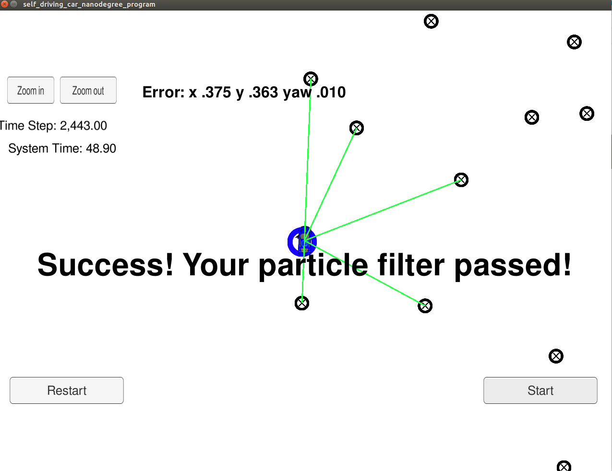

# Kidnapped Vehicle Project

In this project, I implemented a 2 dimensional particle filter in C++. The particle filter will be given a map and some initial localization information (analogous to what a GPS would provide). At each time step the filter will also get observation and control data.
___
## Project Introduction
The robot has been kidnapped and transported to a new location! Luckily it has a map of this location, a (noisy) GPS estimate of its initial location, and lots of (noisy) sensor and control data.
___
## Running the Code
This project involves the a simulator which can be downloaded [here](https://github.com/udacity/self-driving-car-sim/releases). The simulator can also display the best particle's sensed positions, along with the corresponding map ID associations. This can be extremely helpful to make sure transition and association calculations were done correctly.

This repository includes two files that can be used to set up and install uWebSocketIO for either Linux or Mac systems. For windows you can use either Docker, VMware, or even Windows 10 Bash on Ubuntu to install uWebSocketIO.

Once the install for uWebSocketIO is complete, the main program can be built and ran by doing the following from the project top directory.

1. mkdir build
2. cd build
3. cmake ..
4. make
5. ./particle_filter

Alternatively some scripts have been included to streamline this process, these can be leveraged by executing the following in the top directory of the project:

1. ./clean.sh
2. ./build.sh
3. ./run.sh

Tips for setting up your environment can be found [here](https://classroom.udacity.com/nanodegrees/nd013/parts/40f38239-66b6-46ec-ae68-03afd8a601c8/modules/0949fca6-b379-42af-a919-ee50aa304e6a/lessons/f758c44c-5e40-4e01-93b5-1a82aa4e044f/concepts/23d376c7-0195-4276-bdf0-e02f1f3c665d)

Here is the main protocol that main.cpp uses for uWebSocketIO in communicating with the simulator.

INPUT: values provided by the simulator to the c++ program

// sense noisy position data from the simulator

["sense_x"]

["sense_y"]

["sense_theta"]

// get the previous velocity and yaw rate to predict the particle's transitioned state

["previous_velocity"]

["previous_yawrate"]

// receive noisy observation data from the simulator, in a respective list of x/y values

["sense_observations_x"]

["sense_observations_y"]


OUTPUT: values provided by the c++ program to the simulator

// best particle values used for calculating the error evaluation

["best_particle_x"]

["best_particle_y"]

["best_particle_theta"]

//Optional message data used for debugging particle's sensing and associations

// for respective (x,y) sensed positions ID label

["best_particle_associations"]

// for respective (x,y) sensed positions

["best_particle_sense_x"] <= list of sensed x positions

["best_particle_sense_y"] <= list of sensed y positions
___
On success, the simulator output says:

```
Success! Your particle filter passed!
```

___

## Implementing the Particle Filter
The directory structure of this repository is as follows:

```
root
|   build.sh
|   clean.sh
|   CMakeLists.txt
|   README.md
|   run.sh
|
|___data
|   |   
|   |   map_data.txt
|   
|   
|___src
    |   helper_functions.h
    |   main.cpp
    |   map.h
    |   particle_filter.cpp
    |   particle_filter.h
```

If you are interested, take a look at `src/main.cpp` as well. This file contains the code that will actually be running your particle filter and calling the associated methods.

## Inputs to the Particle Filter
You can find the inputs to the particle filter in the `data` directory.

#### The Map*
`map_data.txt` includes the position of landmarks (in meters) on an arbitrary Cartesian coordinate system. Each row has three columns
1. x position
2. y position
3. landmark id

### All other data the simulator provides, such as observations and controls.

> * Map data provided by 3D Mapping Solutions GmbH.
___

## More resources

You might want to check out the following for more on particle filters:
- [Sebastian's article about the particle filter in robotics.](http://robots.stanford.edu/papers/thrun.pf-in-robotics-uai02.pdf)
- [Parallel resampling in the particle filter](https://arxiv.org/abs/1301.4019)
- [Particle filters](https://arxiv.org/pdf/1309.7807) 
- [An Introduction to Particle Filtering](https://www.lancaster.ac.uk/pg/turnerl/PartileFiltering.pdf)
- [A Tutorial on Particle Filtering and Smoothing: Fifteen years later](https://www.stats.ox.ac.uk/~doucet/doucet_johansen_tutorialPF2011.pdf)

The following links will help improve your knowledge in c++:
- [Tips and Tricks for c++ Professionals.](http://www.bordoon.com/cplusplus/book_wrapper.html)
- [How To Document and Organize Your C++ Code.](http://www.edparrish.net/common/cppdoc.html)
- [Advanced C++ Techniques Explained.](http://cplusplus.bordoon.com/cplusplusadvice.html)
- [Wiki books-Optimizing C++](https://en.wikibooks.org/wiki/Optimizing_C%2B%2B)
- [Stackoverflow thread-General C++ Performance Improvement Tips](https://stackoverflow.com/questions/2030189/general-c-performance-improvement-tips)
___

## Troubleshooting

If the error is missing `zlib` while installing uWebSocketIO, run the following command to install zlib...
```
sudo apt-get install zlib1g-dev
```

